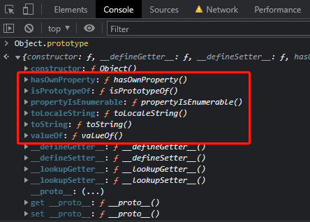
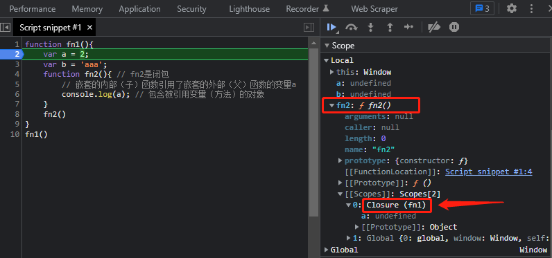

【本教程视频】https://www.bilibili.com/video/BV14s411E7qf?p=2&spm_id_from=pageDriver

### 一、类型

基本类型：String、Number、boolean、undefined、null

对象类型：Object（任意对象）、Function（可以执行的对象）、Array

判断：typeof、instanceof（判断是否是对象的实例）、=== 、==

### 二、函数调用 call()/apply()

```js
function test(){
	console.log('text function!');
};
var obj = {};
// test.call(obj);
test.apply(obj); // 临时让test成为obj的方法进行调用
```

### 三、回调函数

定义：没有调用，但函数执行了

```html
<!DOCTYPE html>
<html lang="en">
<head>
    <meta charset="UTF-8">
    <title>Title</title>
</head>
<body>
    <button id='btn'>点击</button>
    <script>
        // dom事件回调函数
        document.getElementById('btn').onclick = function(){
            alert('lalalallalala');
        };

        // 定时器回调函数
        setTimeout(function(){
            alert('heyheyhey');
        }, 2000); // 2秒后执行
    </script>
</body>
</html>
```

### 四、构造函数

```js
function Fun(){}
// 使用new关键字来实例化一个对象，那么Fun()就是一个构造函数
// 普通函数与构造函数本质上没有任何区别，只是我们调用的方式不同而已，关键在于一个关键字 new
var fun1 = new Fun(); 
```

### 五、IIFE立即执行函数

【参考】https://blog.csdn.net/stpice/article/details/80586444

作用：不污染全局环境

```js
!(function(){}());

!(function(){})();

//传参
(function foo(arg1,arg2,...){...}(param1,param2,...));
```

### 六、this

`this` 同python中 `self`。

- 在全局作用域（没有指定调用者的）， `this` = `window`

  ```js
  function zz(){
     console.log(this);  // window对象
  }
  zz();  //这里是window调用的，window.zz()
  ```

- 在方法作用域，`this` = 调用者

- 类的方法里面，`this` = 类自己

```js
function Person(color) {
    console.log(this);
    this.color = color;
    this.getColor = function (){
        console.log(this);
    }
    this.setColor = function (color){
        console.log(this);
        this.color = color;
    }
}

Person('red'); //this是谁？ window

var p = new Person('yellow'); //this是谁？ p

p.getColor(); //this是谁？ p

var obj = {};  
// 临时让setColor成为obj的方法进行调用
p.setColor.call(obj, 'black'); //this是谁？ obj

var test = p.setColor;
test(); //this是谁？ window
```

```js
function fun1(){
    function fun2() {
        console.log(this);
    }
    fun2();  //this是谁？ window
}
fun1();
```

### 七、prototype / `__proto__`

#### 1、prototype 

- 1）每个函数都有一个prototype属性，它默认指向一个Object空对象

  - 即称为：原型对象（亦称为显式原型），没有自定义的属性；

- 2）可以给原型对象添加属性（一般都是方法）

  - 作用：函数的所有实例对象自动拥有原型中的属性（方法）

- ```js
  function Fun(){}
  console.log(Fun.prototype); //1）默认指向一个Object空对象（即称为：原型对象，没有自定义的属性）
  
  // 2）给原型对象添加属性（一般都是方法）
  Fun.prototype.test = function(){console.log('test!!!')}
  
  // 实例对象自动拥有原型中的属性（方法）
  var fun1 = new Fun()
  fun1.test()
  ```

- 3）原型对象中有一个属性constructor，它指向函数对象

  - ```js
    console.log(Date === Date.prototype.constructor) // true
    ```

​	总结：函数的prototype属性：在定义函数时自动添加的，默认值是一个空Object对象

#### 2、`__proto__`

- 4）每个实例对象都有一个 `__proto__`，可称为隐式原型

- 5）对象的隐式原型（`__proto__`）的值为其对应的构造函数的显式原型（prototype）的值

- ```js
  function Fun(){}
  
  // 4）每个实例对象都有一个 __proto__，可称为隐式原型
  var fun1 = new Fun();
  console.log(fun1.__proto__)
  
  // 5）对象的隐式原型（__proto__）的值为其对应的构造函数的显式原型（prototype）的值
  console.log(fun1.__proto__ === Fun.prototype) // true
  ```

-  6）所有函数都是Function的实例（包括Function），所以函数也有`__proto__`

总结：对象的`__proto__`属性：创建对象时自动添加的，默认值为其构造函数的prototype属性值

#### 3、Object

JavaScript中的所有对象都来自 Object；所有对象从Object.prototype继承方法和属性，所以我们自建的对象均有Object中的属性和方法。如下,



### 八、原型链

- 访问一个对象的属性（方法）时，
  - 先在自身属性中查找，找到返回
  - 如果没有，再沿着 `__proto__` 这条链向上查找，找到返回
  - 如果最终（Object.prototype）没有找到，返回 undefined
- Object的原型对象是原型链的尽头

### 九、闭包

#### 1、如何产生闭包？

- 当一个嵌套的内部（子）函数引用了嵌套的外部（父）函数的变量（方法）时，就产生了闭包

- ```js
  function fn1(){
      var a = 2;
      var b = 'aaa';
      function fn2(){ // fn2是闭包
          // 嵌套的内部（子）函数引用了嵌套的外部（父）函数的变量a
          console.log(a); // 包含被引用变量（方法）的对象
      }
      fn2()
  }
  fn1()
  ```

#### 2、闭包到底是什么？

- 理解一：闭包是嵌套的内部函数
- 理解二：嵌套函数中包含被引用变量（方法）的对象，如上面的代码
- 可以在浏览器控制台打断点查看哪个是闭包，如下，
  - 

#### 3、产生闭包的条件

- 函数嵌套
- 内部函数引用了外部函数的数据（变量/方法）

#### 4、闭包的作用

- 1）使得函数内部的变量在函数执行完后，仍然存活在内存中（延长了局部变量的生命周期）

- 2）让函数外部可以操作函数内部的数据（变量/方法）

  - ```js
    function fn1(){
        var a = 2;
        function fn2(){ // fn2是闭包
            a++;
            console.log(a)
        }
        return fn2  // 返回的变量名
    }
    /*
    f 同 fn2，指向同一个地址（闭包）；
    在fn1()执行完成后，fn2不在了，但是f还在（换了个名字），这个闭包就还在，那么闭包中的变量a就还在，
    所以后面可以继续操作变量a
    */
    var f = fn1(); 
    f(); // 3
    f(); // 4 。这一步是在上一步的基础上执行的，即上一步执行完后，变量a 仍然存活在内存中；并且是操作函数内部的变量
    f = null; //释放闭包
    ```

- 注意：

  - a、函数执行完后，函数内部声明的局部变量是否还存在？
    - 一般是不存在的，存在于闭包中的变量才可能存在（有变量指向这个闭包就还存在，如上面的代码）
  - b、在函数外部能直接访问函数内部的局部变量吗？
    - 不能，但闭包可以

#### 5、闭包的缺点

- 函数执行完成后，函数内部的局部变量没有释放，占用内存时间会变长
- 容易造成内存泄漏（）
  - 解决方法：能不用闭包就不用；及时释放